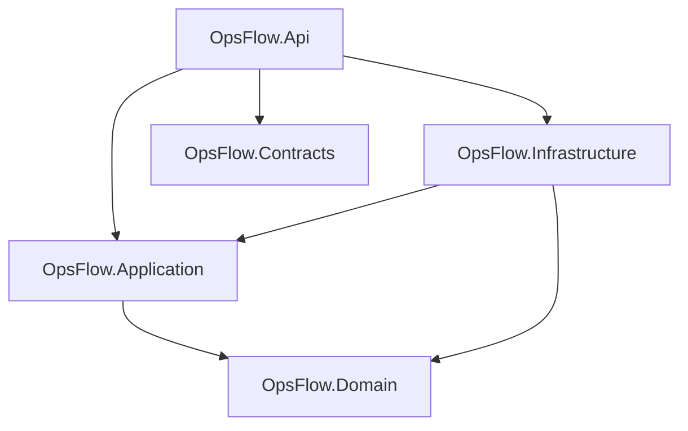

# Architecture Overview

This document describes the **current** OpsFlow foundation (Phase 0). It
deliberately describes only what exists today. Planned capabilities are noted as
planned, not as implemented.

## Style: modular monolith

OpsFlow is being built as a **modular monolith**: a single deployable backend
organized into clear internal layers, rather than a set of distributed
microservices. See
[ADR-001](decisions/ADR-001-modular-monolith.md) for the rationale.

## Backend projects and dependency direction

The backend solution (`OpsFlow.sln`) contains five projects under
`src/backend/`:

| Project                  | Role                                             | References |
|--------------------------|--------------------------------------------------|------------|
| `OpsFlow.Domain`         | Domain model (currently only an assembly marker) | none |
| `OpsFlow.Contracts`      | API request/response contracts (currently empty) | none |
| `OpsFlow.Application`    | Use cases / application logic (currently empty)  | `Domain` |
| `OpsFlow.Infrastructure` | Adapters (currently empty)                       | `Application`, `Domain` |
| `OpsFlow.Api`            | ASP.NET Core host (shell only)                   | `Application`, `Contracts`, `Infrastructure` |

The actual current project references are:

- `Domain` and `Contracts` depend on no other OpsFlow project.
- `Application` depends on `Domain`.
- `Infrastructure` depends on `Application` and `Domain`.
- `Api` depends on `Application`, `Contracts` and `Infrastructure` and wires
  everything together.

At this stage these projects compile but contain no business logic. `Domain`
holds only a small `AssemblyMarker` type used by the backend smoke test.

## Frontend boundary

The frontend (`src/frontend/opsflow-web/`) is a React + TypeScript application
built with Vite. It is currently a minimal application shell and does not call
the backend API yet.

## Local SQL Server boundary

Local development uses Microsoft SQL Server 2022 (Developer edition) running in
Docker, defined in `docker-compose.yml`. See
[ADR-002](decisions/ADR-002-local-sql-server.md). The database is available for
local development, but the API does not connect to it yet — there is no Entity
Framework Core setup, no migrations and no data access in Phase 0.

## Not present yet (planned for later phases)

The following are **not** implemented in Phase 0 and are intentionally absent:

- Domain modules (customers, work orders, assignments, comments, time tracking,
  attachments, dashboard, audit, notifications).
- Authentication and authorization.
- Multi-organization (tenant) isolation.
- Database access, EF Core and migrations.
- Background processing / messaging (outbox).
- Email or file storage.
- Any Azure or other cloud resources.

## Diagrams

- [System context](diagrams/system-context.md)
