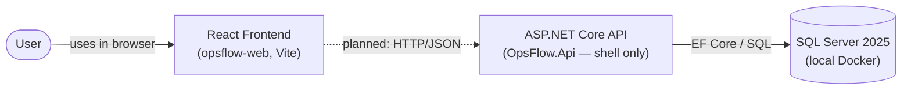

# System Context (Phase 0)

This diagram shows the current high-level pieces of OpsFlow. Solid lines are
implemented; dashed lines are **planned for a later phase** and not yet
implemented.

## Notes

- **User → React frontend**: the frontend is served as a static SPA in
  development; a user interacts with it in the browser.
- **React frontend ⇢ ASP.NET Core API** (*planned*): the frontend does not call
  the API yet.
- **ASP.NET Core API → SQL Server**: the API uses EF Core and SQL Server for
  implemented persistence-backed features (authentication, projects, documents).

Azure, message queues, email, background workers and external integrations are
intentionally excluded from Phase 0.
